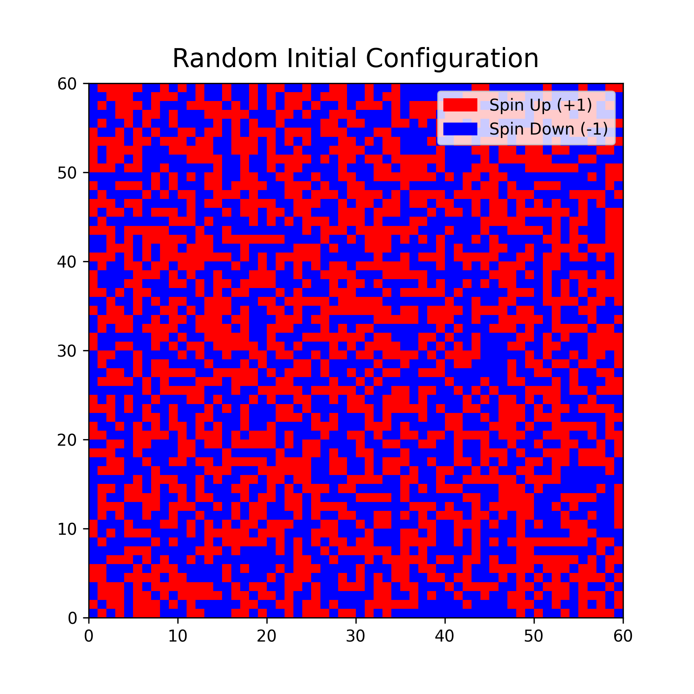
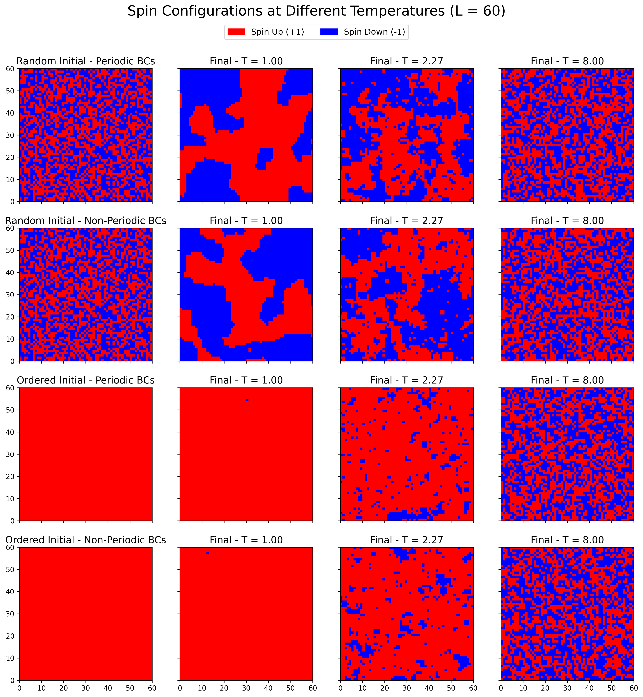
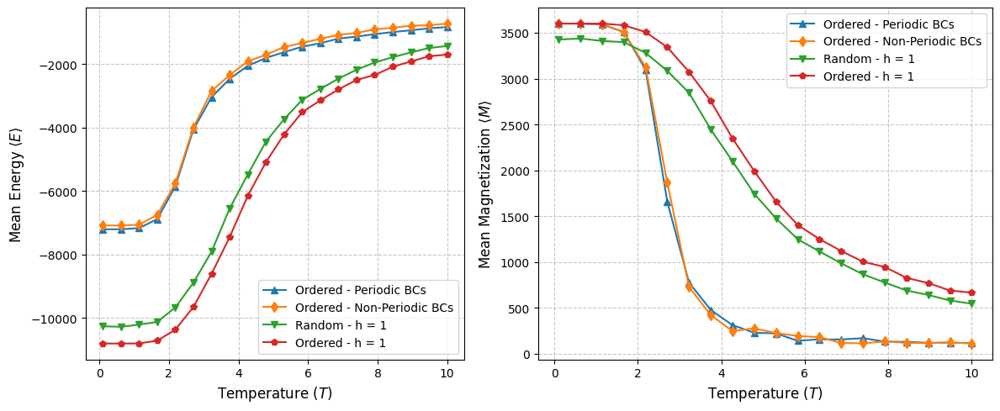
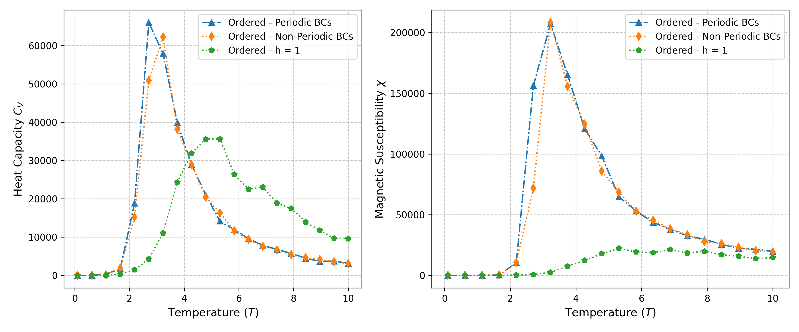
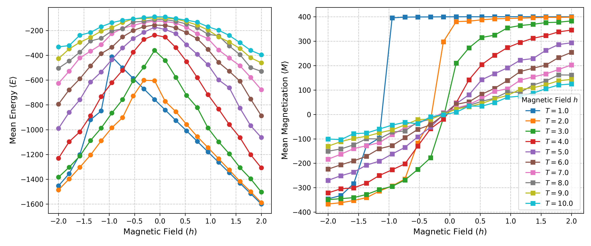
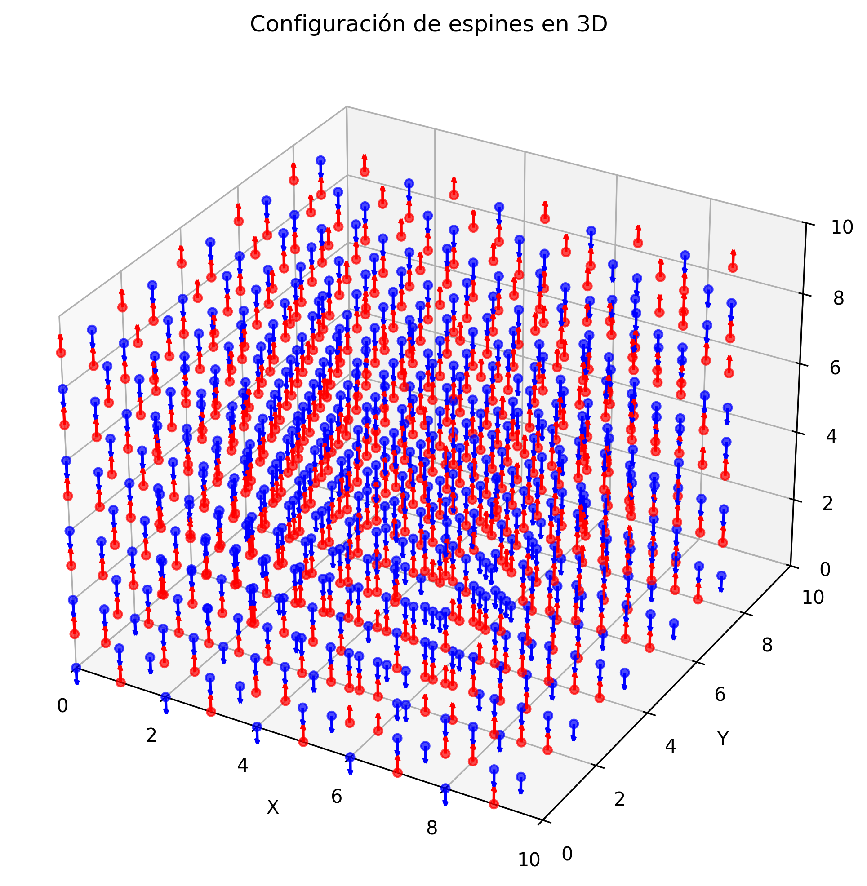
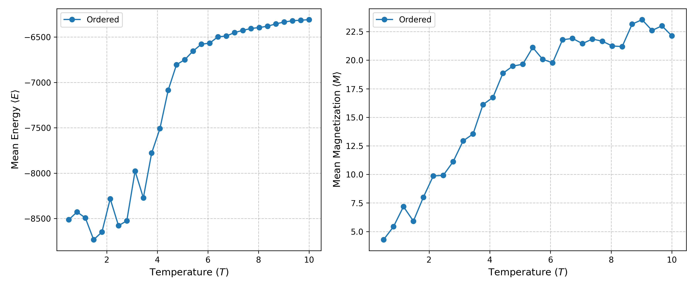

# Explorando el modelo de Ising: Simulaciones Montecarlo en 2D y 3D

# 📌 ¿Qué hace el proyecto?

Este proyecto implementa una simulación del modelo de Ising utilizando el método de Montecarlo en dos y tres dimensiones. Se emplea el algoritmo de Metropolis para modelar la evolución de un sistema de espines y estudiar su comportamiento térmico.

Supongamos  N  partículas colocadas en una matriz cuadrada. Cada partícula tiene un espín asociado que puede apuntar sólo en dos sentidos, arriba o abajo ( σi=±1 ). Cada una de esas orientaciones se llaman espín de la partícula. El sentido del espín queda determinado mediante la interacción de la partícula con sus vecinas, por fluctuaciones térmicas ( T ) y por campos magnéticos externos ( h ).

El Hamiltoniano del modelo de Ising en una red de  N  sitios es:

$$\mathcal{H} = -J \sum_{\langle i,j \rangle} \sigma_i \sigma_j - h \sum_{i} \sigma_i$$

Donde:

J  es la constante de acoplamiento o integral de intercambio representa la fuerza de interacción entre los espines vecinos (si  J>0 , la interacción es ferromagnética; si  J<0 , es antiferromagnética).

⟨i,j⟩  indica la suma sobre pares de sitios vecinos.

h  es el campo magnético externo.

σi  representa los espines individuales ( σi=±1 )

---

# 🎯 ¿Por qué el proyecto es útil?

El modelo de Ising es una herramienta fundamental en física estadística para comprender las transiciones de fase y el magnetismo en materiales. Este proyecto permite:

* Visualizar la evolución de los espines en diferentes temperaturas.

* Calcular magnitudes termodinámicas como la energía interna, magnetización, capacidad calorífica y suceptibilidad magnética.

La magnetización total del sistema, que mide la alineación promedio de los espines, se define como:

$$M = \sum_i \sigma_i$$

La capacidad calorífica, que describe cómo varía la energía interna del sistema con la temperatura, está dada por:

$$ C_v =  \frac{1}{k_B T^2} (\langle E^2 \rangle - \langle E \rangle^2) $$
  
donde $E$ es la energía total del sistema.

La susceptibilidad magnética, que mide la respuesta del sistema a un campo magnético externo, se define como:

$$ \chi =  \frac{1}{k_B T} (\langle M^2 \rangle - \langle M \rangle^2) $$

Estas cantidades permiten estudiar el comportamiento crítico del sistema, particularmente cerca de la transición de fase ferromagnética en dos dimensiones cuando $J>0$.

---
## 🖥️ ¿Qué hace el código?

## **Fase 1: Implementación del Modelo de Ising 2D ($h=0$)**

1. Inicialización
   - Definir una red L×L con valores de espín si=±1 .
   - Implementar condiciones de frontera periódicas y no periódicas.
   - Elegir un estado inicial (aleatorio y completamente ordenado).
   - Todo se realiza para tres diferentes temperaturas.

2. Cálculo de la Energía y Magnetización
   - Definir la función de energía total del sistema.
   - Definir la magnetización.

3. Algoritmo de Montecarlo con Metrópolis
   - Seleccionar un espín al azar y calcular el cambio de energía ΔE si se invierte.
   - Generar un número aleatorio $r$ entre $[0,1]$
   - Aceptar el cambio si $r < e^{-\beta\Delta E} $.
   - Repetir el proceso para un número suficiente de iteraciones.

4. Animación
  - Se gráfica en un video su evolución.

5. ¿Hasta que iteración es necesario hacer?
  - Se gráfica la energía media y magnetización en cada paso. Implementando un criterio de convergencia basado en la fluctuación de la magnetización o la energía.

6. Medición de Observables
   - Promediar energía, magnetización, suceptibilidad y calor específico a distintas temperaturas.
   - Implementar un barrido en temperatura para encontrar Tc .
     
## **Fase 2: Implementación del Modelo de Ising 2D ($h \neq 0$)**

1. Se realizan los mismos analisis anteriores pero teniendo en cuenta el campo
    - Solo se trabajará con las condiciones de frontera periodicas. Esta fase está superpuesta con la fase 1 por comodidad.

2. Estudio del diagrama de fases en función de $T$ y $h$.

## Fase 3: Extensión modelo de Ising 3D

1. Red cúbica L×L×L.
   - Modificar el código para manejar la tercera dimensión.
   - Ajustar las interacciones vecinas y condiciones de frontera.

---

# 📊 Resultados

Todos los gráficos se pueden observar en [´Proyecto Montecarlo/images´](https://github.com/santiagoruizp/Computacion-Avanzada/tree/main/Proyecto%20Montecarlo/images). 

Algunos gráficos generados por la simulación incluyen:

Configuración inicial aleatoria.

Configuraciones iniciales y finales para 3 temperaturas, variando las condiciones.

Curva de energía y magnetización en función de la temperatura.

Curvas de capacidad calorifica y suceptibilidad magnética.

Curvas de enegía y magnétización en función del campo magnético.

](https://github.com/santiagoruizp/Computacion-Avanzada/blob/main/Proyecto%20Montecarlo/images/9.Mvsh-varied%20T_L%3D20.png)

Visualización configuración en 3D.

Curva de energía y magnetización en función de la temperatura para 3D.

---

# ❓ Dónde recibir ayuda

Si tienes dudas o encuentras problemas, puedes:

Contactarme en **santiago.ruizp@udea.edu.co**

# 👩‍💻 Quién mantiene y contribuye

Este proyecto es mantenido por:

 Santiago Ruiz Piedrahita.
 
 Físico, Universidad de Antioquia.
 
 Estudiante maestría en Física, Universidad de Antioquia.

