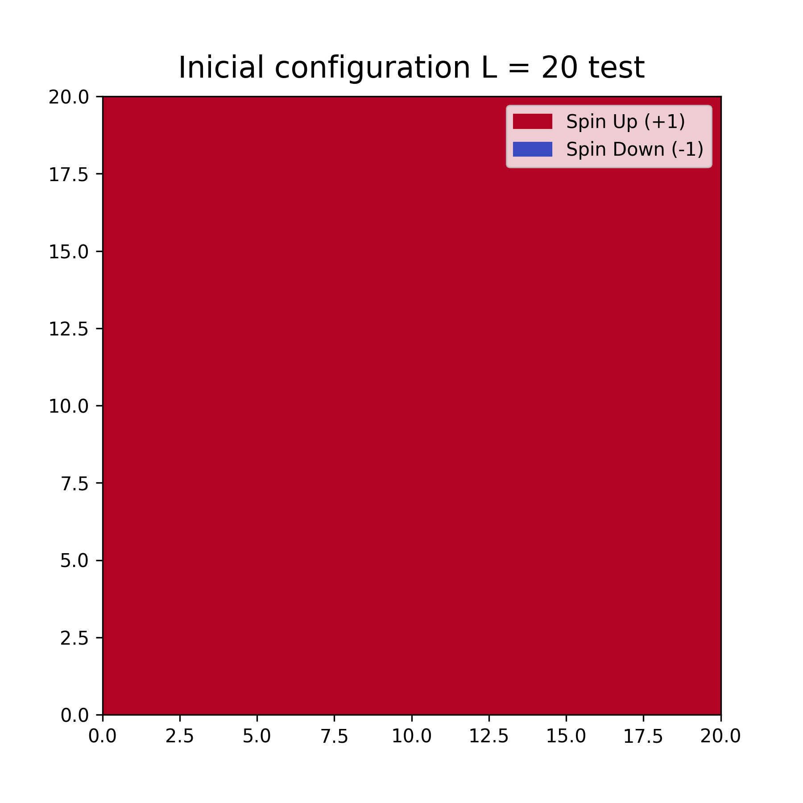
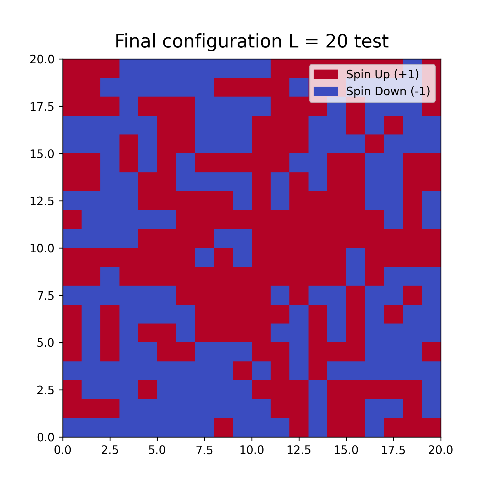

# Modelo de Ising 2D: Explorando la paralelización

# 📌 ¿Qué hace el proyecto?

Este proyecto implementa una simulación del modelo de Ising utilizando el método de Montecarlo en dos dimensiones. Se emplea el algoritmo de Metropolis para modelar la evolución de un sistema de espines y estudiar su comportamiento térmico. El análisis es abordado desde la computación en serie y la computación en paralelo, haciendo una comparación de los tiempos de computo, además de comparaciones entre Google Colab y un servidor.

Supongamos  N  partículas colocadas en una matriz cuadrada. Cada partícula tiene un espín asociado que puede apuntar sólo en dos sentidos, arriba o abajo ( σi=±1 ). Cada una de esas orientaciones se llaman espín de la partícula. El sentido del espín queda determinado mediante la interacción de la partícula con sus vecinas, por fluctuaciones térmicas ( T ) y por campos magnéticos externos ( h ).

El Hamiltoniano del modelo de Ising en una red de  N  sitios es:

$$\mathcal{H} = -J \sum_{\langle i,j \rangle} \sigma_i \sigma_j - h \sum_{i} \sigma_i$$

Donde:

J  es la constante de acoplamiento o integral de intercambio representa la fuerza de interacción entre los espines vecinos (si  J>0 , la interacción es ferromagnética; si  J<0 , es antiferromagnética).

⟨i,j⟩  indica la suma sobre pares de sitios vecinos.

h  es el campo magnético externo.

σi  representa los espines individuales ( σi=±1 )

---

# 🎯 ¿Por qué el proyecto es útil?

El modelo de Ising es una herramienta fundamental en física estadística para comprender las transiciones de fase y el magnetismo en materiales. Este proyecto permite:

* Visualizar la evolución de los espines en diferentes temperaturas.

* Calcular magnitudes termodinámicas como la energía interna, magnetización, capacidad calorífica y suceptibilidad magnética.

La magnetización total del sistema, que mide la alineación promedio de los espines, se define como:

$$M = \sum_i \sigma_i$$

La capacidad calorífica, que describe cómo varía la energía interna del sistema con la temperatura, está dada por:

$$ C_v =  \frac{1}{k_B T^2} (\langle E^2 \rangle - \langle E \rangle^2) $$
  
donde $E$ es la energía total del sistema.

La susceptibilidad magnética, que mide la respuesta del sistema a un campo magnético externo, se define como:

$$ \chi =  \frac{1}{k_B T} (\langle M^2 \rangle - \langle M \rangle^2) $$

Estas cantidades permiten estudiar el comportamiento crítico del sistema, particularmente cerca de la transición de fase ferromagnética en dos dimensiones cuando $J>0$.

---

# 🖥️ ¿Qué hace el código?

## Fase 1: Implementación del Modelo de Ising 2D.

1. Se implementa la clase `IsingModel2D`, que modela un sistema cuadrado de espines utilizando interacciones de primer vecino.
  - Solo se trabaja con condiciones de frontera periódicas (pbc), una configuración inicial ordenada, sistemas ferromagnéticos ($J = 1$), en ausencia de campos magnéticos externos ($h \ne 0$). Sin embargo el código cuenta con las herramientas necesarias para hacer los análisis con otras condiciones.
2. Se realiza una prueba inicial del modelo simulando un solo valor de temperatura para L=20, verificando la correcta evolución de energía y magnetización.
3. Se lleva a cabo un análisis de convergencia, simulando una temperatura fija y variando el tamaño del sistema L, observando la dependencia de los resultados con el tamaño de la red.
4. Se estudia el cambio de fase del sistema analizando el comportamiento de la energía y la magnetización al variar la temperatura, repitiendo este procedimiento para diferentes valores de L.

## Fase 2: Computación en paralelo.

1. Se verifica el correcto funcionamiento de la paralelización mediante la implementación de procesamiento paralelo con `multiprocessing`, asegurando que los resultados coincidan con los obtenidos en serie.
2. Se repite el análisis del cambio de fase utilizando computación en paralelo, evaluando la eficiencia en la ejecución cuando se varían tanto la temperatura como el tamaño del sistema L.

## Fase 3: Análisis de tiempos de cómputo.

1. Se realiza un estudio comparativo de los tiempos de ejecución, considerando:
   - Diferencias entre la ejecución en Google Colab y en un servidor local.
   - Comparaciones entre la computación en serie y la computación en paralelo, evaluando las ventajas del paralelismo para diferentes tamaños de sistema.
  
# 📊 Resultados

Todos los gráficos se pueden observar en [´Proyecto Paralelización/Imagenes´](https://github.com/santiagoruizp/Computacion-Avanzada/tree/main/Proyecto%20Paralelizaci%C3%B3n/Imagenes). 

Algunos gráficos generados por la simulación incluyen:

Configuración inicial ordenada, L = 20.

Configuración final, L = 20.

# ❓ Dónde recibir ayuda

Si tienes dudas o encuentras problemas, puedes:

Contactarme en **santiago.ruizp@udea.edu.co**

# 👩‍💻 Quién mantiene y contribuye

Este proyecto es mantenido por:

 Santiago Ruiz Piedrahita.
 
 Físico, Universidad de Antioquia.
 
 Estudiante maestría en Física, Universidad de Antioquia.

